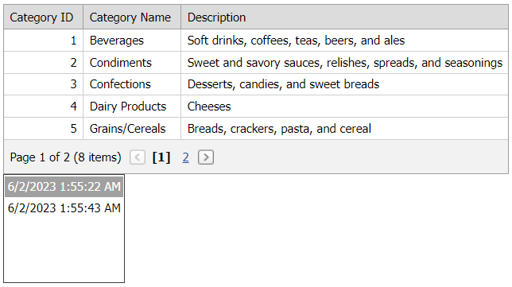

# Grid View for ASP.NET Web Forms - How to use a list box editor to save and restore client layout
<!-- run online -->
**[[Run Online]](https://codecentral.devexpress.com/e2534/)**
<!-- run online end -->

This example demonstrates how to handle the grid's `ClientLayout` event to save and restore the grid's client layout. The modified layouts are added to a list box editor.



## Overview

The main idea is to handle the grid's server-side [ClientLayout](https://docs.devexpress.com/AspNet/DevExpress.Web.ASPxGridBase.ClientLayout) event to save the modified client layout to a `Dictionary<string, string>` and add the layout to a list box editor. Then, a user can choose the layout from the editor and apply it to the grid.

```cs
protected void Grid_ClientLayout(object sender, ASPxClientLayoutArgs e) {
    if (e.LayoutMode == ClientLayoutMode.Saving && isSaveLayout) {
        string key = DateTime.Now.ToString();
        string layout = e.LayoutData;
        Dictionary<string, string> dictionary = Session["layout"] as Dictionary<string, string>;
        if (!dictionary.ContainsValue(layout)) {
            ListBox.Items.Add(key, layout);
            dictionary[key] = layout;
        }
        else {
            Session["selectedLayout"] = layout;
        }
        Session["layout"] = dictionary;
    }
}
```

## Files to Review

* [Default.aspx](./CS/WebSite/Default.aspx) (VB: [Default.aspx](./VB/WebSite/Default.aspx))
* [Default.aspx.cs](./CS/WebSite/Default.aspx.cs) (VB: [Default.aspx.vb](./VB/WebSite/Default.aspx.vb))

## Documentation

* [Save and Restore Client Layout](https://docs.devexpress.com/AspNet/4342/components/grid-view/concepts/save-and-restore-client-layout)
